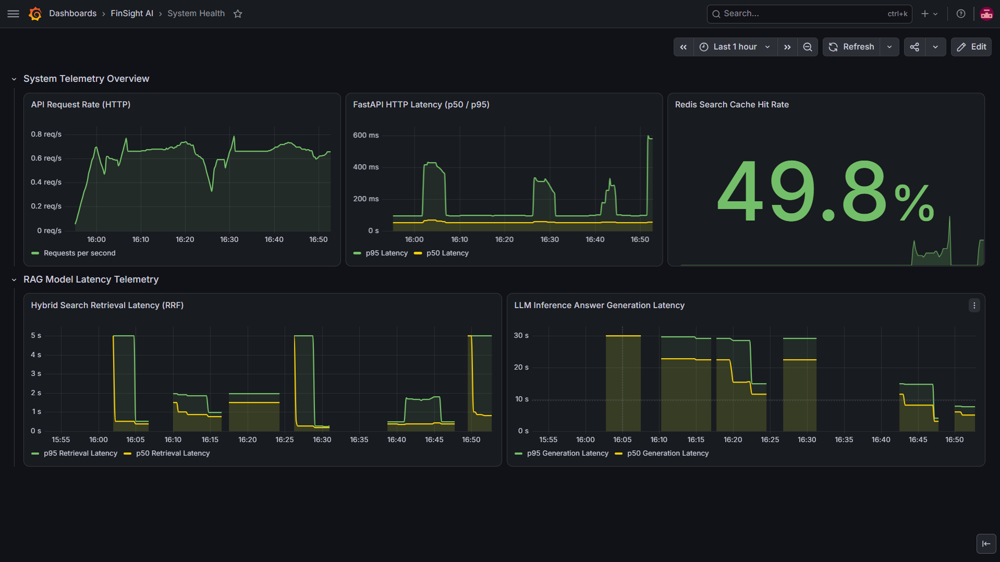
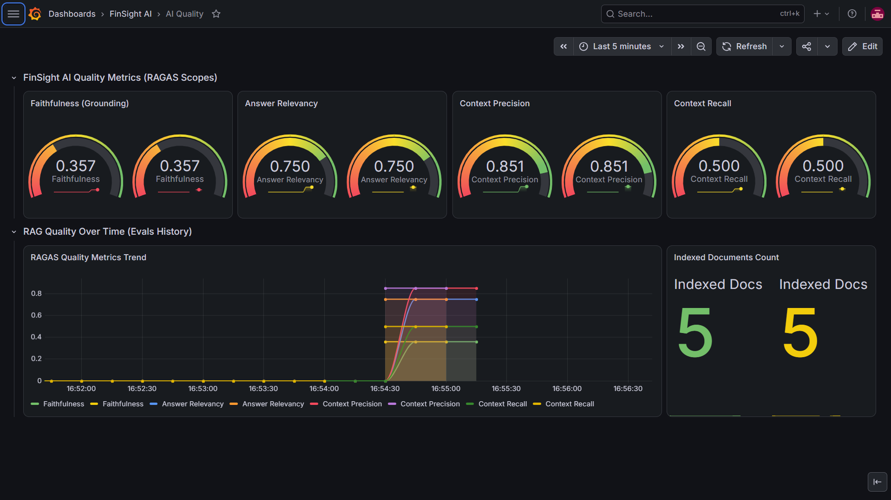
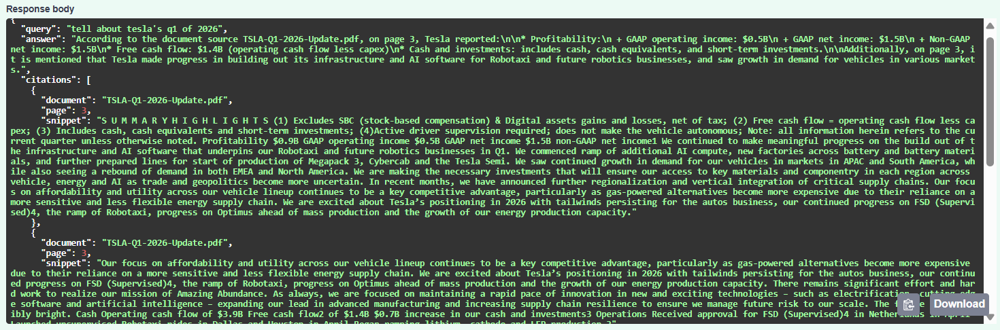

# FinSight AI

[](https://github.com/AyushPallod/FinSight_AI)

[](https://www.python.org/)

[](https://www.docker.com/)

[](https://opensource.org/licenses/MIT)

**FinSight AI** is an advanced Retrieval-Augmented Generation (RAG) platform designed specifically for processing and analyzing complex financial documents. Utilizing a powerful stack of modern AI and web technologies, FinSight AI allows users to upload financial PDFs, extract critical insights, and chat with an intelligent AI assistant grounded purely on the uploaded documents.

---

## 🎯 The Problem

Financial documents are often long, information-dense, and difficult to analyze efficiently. While large language models can make this information easier to query, they can also generate answers that are not grounded in the source material.

FinSight AI addresses this by providing a document-grounded financial analysis system where users can upload financial PDFs and interact with an AI assistant whose responses are grounded in the uploaded documents.

## 🎯 Design Goals

* **Ground responses in uploaded documents** to reduce unsupported answers.
* **Process financial PDFs efficiently** through document chunking and retrieval.
* **Keep inference local** using Ollama for greater control over sensitive financial data.
* **Measure AI response quality** using RAGAS rather than relying only on subjective evaluation.
* **Process documents asynchronously** using background workers for chunking and embedding generation.
* **Provide safety guardrails** against prompt injection, toxic content, and jailbreak attempts.
* **Make system and AI behavior observable** through Prometheus and Grafana.

---

## 🚀 Key Features

* **Intelligent Document Processing:** Seamlessly upload and chunk financial PDFs for optimal retrieval.

* **Retrieval-Augmented Generation (RAG):** Answers are grounded in your data, preventing hallucinations.

* **Local LLM Integration:** Powered by Ollama (Llama 3), ensuring data privacy and local execution.

* **Advanced Vector Search:** Utilizes Qdrant for highly scalable and lightning-fast semantic search.

* **AI Quality Evaluation:** Built-in RAGAS (Retrieval Augmented Generation Assessment) to continuously measure Faithfulness, Answer Relevancy, and Context Recall.

* **Safety Guardrails:** Real-time protection against prompt injection, toxic content, and jailbreak attempts.

* **Comprehensive Observability:** Deep monitoring with Prometheus and Grafana dashboards for both System Health and AI Quality metrics.

* **Secure Architecture:** Nginx Reverse Proxy with HTTPS support.

---

## 📸 Screenshots

### System Dashboard (Grafana)



*Real-time monitoring of API latency, request rates, error rates, and cache hits.*

### AI Quality Dashboard (Grafana)



*RAGAS evaluation metrics showing Faithfulness and Answer Relevancy of the LLM responses.*

### Grounded AI Chat



*Intelligent chat interface providing answers directly cited from uploaded financial documents.*

---

## 🏗️ Architecture

FinSight AI employs a robust microservices architecture orchestrated with Docker Compose:

```text
                         ┌─────────────────────┐
                         │    React Frontend   │
                         └──────────┬──────────┘
                                    │
                                    ▼
                         ┌─────────────────────┐
                         │   Nginx Reverse     │
                         │       Proxy         │
                         └──────────┬──────────┘
                                    │
                                    ▼
                         ┌─────────────────────┐
                         │    FastAPI Backend  │
                         └──────────┬──────────┘
                                    │
             ┌──────────────────────┼──────────────────────┐
             │                      │                      │
             ▼                      ▼                      ▼
   ┌─────────────────┐    ┌─────────────────┐    ┌─────────────────┐
   │   PostgreSQL    │    │      Redis      │    │     Qdrant      │
   │ Document / User │    │ Cache / Broker  │    │ Vector Database │
   │    Metadata     │    │                 │    │                 │
   └─────────────────┘    └────────┬────────┘    └─────────────────┘
                                   │
                                   ▼
                         ┌─────────────────────┐
                         │       Celery        │
                         │   Task Worker       │
                         └──────────┬──────────┘
                                    │
                                    ▼
                         ┌─────────────────────┐
                         │       Ollama        │
                         │    Local LLM        │
                         └─────────────────────┘

              ┌──────────────────────────────────────────┐
              │              Observability                │
              │                                          │
              │     Prometheus ───────► Grafana          │
              └──────────────────────────────────────────┘
```

### RAG Pipeline

```text
Financial PDF
     │
     ▼
Document Processing
     │
     ▼
Chunking
     │
     ▼
Embedding Generation
     │
     ▼
Qdrant Vector Database
     │
     ▼
Retrieval
     │
     ▼
Relevant Context
     │
     ▼
Local LLM (Ollama)
     │
     ▼
Grounded Response
     │
     ▼
Document Citations
```

The system consists of the following services:

1. **Frontend:** React-based UI for seamless user interactions.

2. **Backend:** FastAPI application handling API requests, RAG pipelines, and logic.

3. **Database (PostgreSQL):** Relational store for user and document metadata.

4. **Vector Database (Qdrant):** Stores document embeddings for semantic search.

5. **Cache/Broker (Redis):** Caching layer and message broker for background tasks.

6. **Task Worker (Celery):** Asynchronous background processing (e.g., document chunking and embeddings).

7. **LLM Server (Ollama):** Local inference engine.

8. **Reverse Proxy (Nginx):** API Gateway and HTTPS termination.

9. **Metrics Scraper (Prometheus):** Aggregates telemetry data.

10. **Visualization (Grafana):** Dashboards for system and AI observability.

---

## 🛠️ Setup & Installation

### Prerequisites

* Docker and Docker Compose (Docker Desktop recommended on Windows/Mac)

* Git

### Quick Start

1. **Clone the repository:**

   ```bash
   git clone https://github.com/AyushPallod/FinSight_AI.git
   cd FinSight_AI
   ```

2. **Generate Self-Signed Certificates (For Local HTTPS):**

   *A Python script is provided to automatically generate local certificates.*

   ```bash
   python generate_certs.py
   ```

3. **Start the Stack:**

   *Spin up all 10 services using Docker Compose.*

   ```bash
   docker compose up --build -d
   ```

4. **Access the Services:**

   * **Main App (HTTPS):** `https://localhost`

   * **API Docs (Swagger):** `https://localhost/docs`

   * **Grafana Dashboards:** `http://localhost:3000` (Login: `admin` / `admin`)

   * **Prometheus:** `http://localhost:9090`

---

## 🛡️ Production Readiness

While this project is configured for a robust local deployment, the following steps are recommended before deploying to a production environment:

1. **SSL Certificates:** Replace the self-signed certificates with a trusted CA like Let's Encrypt. The `nginx.conf` contains comments on how to configure this easily.

2. **Secrets Management:** Change all default passwords and secrets in `.env` or `docker-compose.yml`.

3. **Hardware:** A GPU is highly recommended for the Ollama inference server and embedding generation.

---

## 📚 Documentation
- Detailed engineering decisions are captured in the [decisions.md](docs/decisions.md) file, outlining trade‑offs, architecture choices, and alignment with the hiring JD.

## 📄 License

This project is licensed under the MIT License - see the LICENSE file for details.
